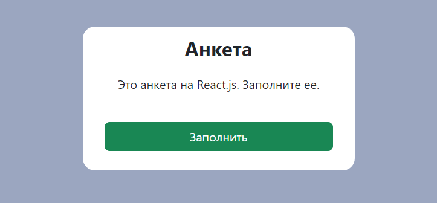
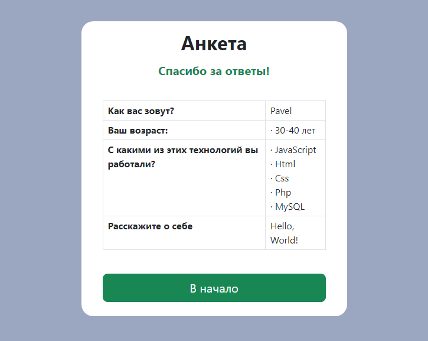

# Анкета на React.js



Пошаговое заполнение анкеты. Вопросы и способы ответа в анкете определяются в массиве объектов с заданными свойствами (файл questions.js). Количество вопросов неограничено. В конце теста выдается результат - заполненная анкета.

[Пример работы](https://mchlv.ru/projects/anketa-react/)

###Способы ответа:
- однострочный текст (type="text");
- многострочный текст (textarea);
- один вариант из списка (type="radio");
- несколько вариантов из списка (type="checkbox").

**Однострочный текст:**
```javascript
    {
        title: 'Как вас зовут?',
        type: 'text',
        completed: false,
        answer: ''
    }
```

**Многострочный текст:**
```javascript
    {
        title: 'Расскажите о себе',
        type: 'textarea',
        completed: false,
        answer: '',
    }
```


**Один вариант из списка:**
```javascript
    {
        title: 'Ваш возраст:',
        type: 'radio',
        completed: false,
        options: [
            {
                title: '18-29 лет',
                checked: false
            },
            {
                title: '30-40 лет',
                checked: false
            },
            {
                //... вариант ответа
            }          
        ],
    }
```

**Несколько вариантов из списка:**
```javascript
    {
        title: 'С какими из этих технологий вы работали?',
        type: 'checkbox',
        completed: false,
        options: [
            {
                title: 'JavaScript',
                checked: false,
            },
            {
                title: 'Html',
                checked: false,
            },
            {
                //... вариант ответа
            } 
        ],
    }
```    

